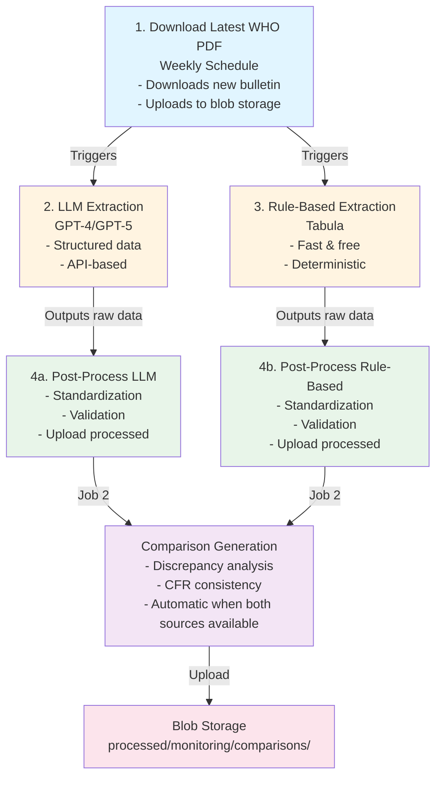
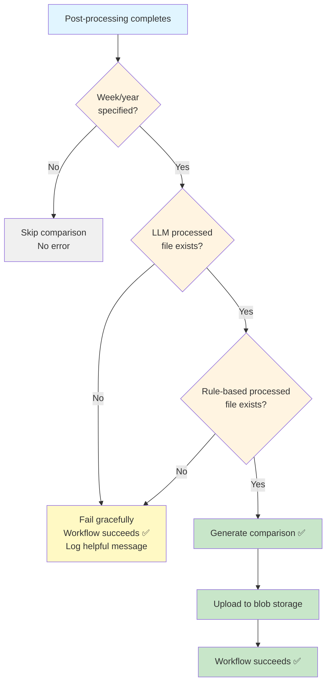

# GitHub Actions Workflows Documentation

This document describes the automated workflows for the cholera PDF extraction and monitoring pipeline.

## Table of Contents

- [Workflow Overview](#workflow-overview)
- [Workflow Details](#workflow-details)
  - [1. Download Latest WHO PDF](#1-download-latest-who-pdf)
  - [2. Extract Data from PDF (LLM)](#2-extract-data-from-pdf-llm)
  - [3. Rule-Based Extraction](#3-rule-based-extraction)
  - [4. Post-Process Extractions](#4-post-process-extractions)
- [Comparison Generation](#comparison-generation)
- [Manual Execution](#manual-execution)
- [Monitoring & Troubleshooting](#monitoring--troubleshooting)

---

## Workflow Overview

The extraction pipeline consists of four main workflows that run automatically or can be triggered manually:



---

## Workflow Details

### 1. Download Latest WHO PDF

**File:** `.github/workflows/download-latest-who-pdf.yml`

**Purpose:** Downloads the latest WHO Weekly Epidemiological Record bulletin.

**Trigger:**
- **Schedule:** Every Monday at 10:00 AM UTC
- **Manual:** `workflow_dispatch`

**Inputs:**
- `week_number` (optional): Specific week to download
- `year` (optional): Year (required if week specified)

**Outputs:**
- PDF uploaded to: `ds-cholera-pdf-scraper/raw/monitoring/pdfs/`
- Download log: `ds-cholera-pdf-scraper/raw/monitoring/download_log.jsonl`

**Environment Variables:**
- `DSCI_AZ_BLOB_DEV_SAS_WRITE`: Azure blob storage SAS token

**Example Manual Run:**
```bash
# Download latest bulletin
gh workflow run download-latest-who-pdf.yml

# Download specific week
gh workflow run download-latest-who-pdf.yml -f week_number=42 -f year=2025
```

---

### 2. Extract Data from PDF (LLM)

**File:** `.github/workflows/extract-from-pdf.yml`

**Purpose:** Extracts cholera surveillance data using LLM (GPT-4o or GPT-5).

**Trigger:**
- **Automatic:** After successful PDF download
- **Manual:** `workflow_dispatch`

**Inputs:**
- `week_number` (optional): Week to extract
- `year` (optional): Year
- `model` (optional): LLM model (default: `gpt-5`)

**Process:**
1. Downloads PDF from blob storage
2. Extracts data using LLM
3. Uploads raw extraction to: `ds-cholera-pdf-scraper/raw/monitoring/llm_extractions/`
4. Triggers post-processing workflow

**Environment Variables:**
- `DSCI_AZ_OPENAI_API_KEY_WHO_CHOLERA`: OpenAI API key
- `DSCI_AZ_BLOB_DEV_SAS_WRITE`: Blob storage token
- `STAGE`: Deployment stage (dev/prod)

**Example Manual Run:**
```bash
# Extract latest with GPT-5
gh workflow run extract-from-pdf.yml

# Extract specific week with GPT-4o
gh workflow run extract-from-pdf.yml -f week_number=42 -f year=2025 -f model=gpt-4o
```

---

### 3. Rule-Based Extraction

**File:** `.github/workflows/rule-based-extract.yml`

**Purpose:** Extracts data using rule-based table detection (Tabula).

**Trigger:**
- **Automatic:** After successful PDF download
- **Manual:** `workflow_dispatch`

**Inputs:**
- `week_number` (optional): Week to extract
- `year` (optional): Year

**Process:**
1. Downloads PDF from blob storage
2. Extracts tables using Tabula (lattice detection)
3. Uploads raw extraction to: `ds-cholera-pdf-scraper/raw/monitoring/rule_based_extractions/`
4. Triggers post-processing workflow

**Advantages:**
- ⚡ Fast (no API calls)
- 💰 Free (no LLM costs)
- 🎯 Deterministic (same input = same output)

**Disadvantages:**
- Sensitive to PDF format changes
- May miss complex table structures

**Environment Variables:**
- `DSCI_AZ_BLOB_DEV_SAS_WRITE`: Blob storage token
- `STAGE`: Deployment stage

**Example Manual Run:**
```bash
# Extract latest
gh workflow run rule-based-extract.yml

# Extract specific week
gh workflow run rule-based-extract.yml -f week_number=42 -f year=2025
```

---

### 4. Post-Process Extractions

**File:** `.github/workflows/post-process-extractions.yml`

**Purpose:** Applies standardization and cleaning to raw extractions.

**Trigger:**
- **Automatic:** Called by extraction workflows
- **Manual:** `workflow_dispatch`

**Inputs:**
- `source` (required): `llm`, `rule-based`, or `both`
- `week_number` (optional): Week to process
- `year` (optional): Year
- `limit` (optional): Limit to N most recent files
- `correct_gap_fill` (optional): Apply experimental gap-filling corrections

**Jobs:**

#### Job 1: post-process
Processes raw extractions and uploads cleaned data.

**Process:**
1. Downloads raw CSV from: `raw/monitoring/{llm,rule_based}_extractions/`
2. Applies post-processing pipeline:
   - Clean numerical fields (remove commas)
   - Standardize CFR format (remove %)
   - Standardize event names
   - Standardize country names
   - Standardize column names
   - Harmonize missing values
   - (Optional) Apply gap-filling corrections
3. Validates processed data
4. Uploads to: `processed/monitoring/{llm,rule_based}_extractions/`

**Output:**
- Processed CSVs with `_processed.csv` suffix
- Example: `OEW42-2025_gpt-5_123_processed.csv`

#### Job 2: generate-comparisons
Automatically generates comparison reports when both LLM and rule-based data exist.

**Process:**
1. Checks if week/year are specified
2. Attempts to load BOTH LLM and rule-based processed files
3. If both exist:
   - Performs discrepancy analysis
   - Categorizes differences (comma issues, zero vs non-zero, magnitude)
   - Checks CFR consistency
   - Identifies unique records (only in one source)
   - Uploads comparison files to blob storage
4. If one missing:
   - Fails gracefully with informative message
   - Workflow still succeeds (green checkmark)

**Comparison Outputs:**
- `OEW{week}-{year}_comparison_summary.csv` - Summary statistics
- `OEW{week}-{year}_discrepancies.csv` - Detailed discrepancies
- `OEW{week}-{year}_cfr_comparison.csv` - CFR consistency analysis
- `OEW{week}-{year}_unique_records.csv` - Records unique to each source

**Location:** `ds-cholera-pdf-scraper/processed/monitoring/comparisons/`

**Error Handling:**
- Uses `continue-on-error: true` to never block pipeline
- Graceful failure if counterpart data doesn't exist
- Clear error messages in logs

**Environment Variables:**
- `DSCI_AZ_BLOB_DEV_SAS_WRITE`: Blob storage token
- `STAGE`: Deployment stage

**Example Manual Run:**
```bash
# Process all LLM extractions
gh workflow run post-process-extractions.yml -f source=llm

# Process specific week (both sources)
gh workflow run post-process-extractions.yml -f source=both -f week_number=42 -f year=2025

# Process with gap-filling corrections
gh workflow run post-process-extractions.yml -f source=llm -f week_number=42 -f year=2025 -f correct_gap_fill=true
```

---

## Comparison Generation

### How It Works

The comparison system automatically generates quality reports when both LLM and rule-based extractions are available for the same week.

### Automatic Triggers

Comparisons are generated automatically when:
1. Post-processing completes successfully
2. Week and year are specified in workflow inputs
3. BOTH LLM and rule-based processed files exist for that week/year

### Decision Logic



### File Selection

When multiple processed files exist for the same week/year:
- Sorts by `run_id` (timestamp) descending
- Selects most recent file
- Example: If you have:
  - `OEW42-2025_gpt-5_100.csv`
  - `OEW42-2025_gpt-5_200.csv` ← Selected (most recent)
  - `OEW42-2025_gpt-5_300.csv` ← Selected (most recent)

### Discrepancy Categories

Discrepancies are automatically categorized:
- **Zero vs Non-Zero**: One source has 0, the other has a value
- **Comma/Thousands Issue**: Values differ by 10x, 100x, or 1000x
- **Large Difference (>100)**: Absolute difference exceeds 100
- **Medium Difference (21-100)**: Absolute difference between 21-100
- **Small Difference (≤20)**: Absolute difference 20 or less

### CFR Consistency Check

For each discrepancy with CFR data:
- Calculates: `CFR_error = |calculated_CFR - stated_CFR|`
- Calculated CFR: `(Deaths / TotalCases) × 100`
- Identifies which source (LLM or rule-based) has better CFR consistency

### Manual Comparison Generation

If workflows get out of sync, generate comparisons manually:

```bash
# Using standalone CLI (local)
python -m src.monitoring.comparisons --week 42 --year 2025 --stage dev --output ./results

# Using standalone CLI (upload to blob)
python -m src.monitoring.comparisons --week 42 --year 2025 --stage dev

# Compare specific files
python -m src.monitoring.comparisons \
  --llm-file OEW42-2025_gpt-5_processed.csv \
  --rule-based-file OEW42-2025_rule-based_processed.csv \
  --output ./results

# Compare date range
python -m src.monitoring.comparisons --start-date 2025-01-01 --end-date 2025-03-31 --stage dev
```

---

## Manual Execution

### Using GitHub CLI

All workflows support manual execution via GitHub CLI:

```bash
# Check available workflows
gh workflow list

# View recent runs
gh run list --limit 10

# Trigger a workflow
gh workflow run <workflow-name.yml> -f input1=value1 -f input2=value2

# Run on specific branch
gh workflow run <workflow-name.yml> --ref feature-branch

# View run status
gh run view <run-id>

# View run logs
gh run view <run-id> --log

# Watch run in progress
gh run watch <run-id>
```

### Using GitHub UI

1. Navigate to **Actions** tab
2. Select workflow from left sidebar
3. Click **Run workflow** button
4. Fill in inputs (if any)
5. Click **Run workflow**

---

## Monitoring & Troubleshooting

### Checking Workflow Status

```bash
# List recent runs for specific workflow
gh run list --workflow=post-process-extractions.yml --limit 10

# View specific run
gh run view 19867595169

# Check logs for errors
gh run view 19867595169 --log | grep -i error

# View specific job
gh run view --job=56934544642
```

### Common Issues

#### 1. Comparison Job Fails (Expected)

**Symptom:**
```
⚠️  Comparison generation failed
This is expected if only one extraction type has been run.
```

**Cause:** Only one source (LLM or rule-based) has processed data for that week.

**Solution:** This is EXPECTED behavior. Run the missing extraction:
```bash
# If LLM is missing
gh workflow run extract-from-pdf.yml -f week_number=42 -f year=2025

# If rule-based is missing
gh workflow run rule-based-extract.yml -f week_number=42 -f year=2025
```

#### 2. Comparison Job Succeeds But No Files Generated

**Symptom:** Workflow shows green checkmark but no comparison files in blob storage.

**Cause:** Comparison detected no discrepancies or only one unique record type.

**Solution:** Check the logs:
```bash
gh run view <run-id> --log | grep "Value discrepancies"
```

If it shows `Value discrepancies: 0`, this is expected (no differences found).

#### 3. Blob Upload Failures

**Symptom:**
```
❌ Failed to upload to blob storage
```

**Cause:**
- SAS token expired
- Network issues
- Blob storage service unavailable

**Solution:**
1. Check SAS token in repository secrets
2. Verify blob storage is accessible
3. Re-run workflow after checking GitHub Actions status

#### 4. Post-Processing Fails

**Symptom:**
```
## Post-Processing Failed ❌
```

**Cause:**
- Invalid CSV format
- Missing required columns
- Data validation errors

**Solution:**
1. Check logs for specific error
2. Inspect raw CSV file in blob storage
3. Verify extraction workflow completed successfully

### Viewing Comparison Results

**In blob storage:**
1. Navigate to Azure Storage Explorer
2. Open container: `projects`
3. Path: `ds-cholera-pdf-scraper/processed/monitoring/comparisons/`
4. Download CSV files

**Using Python:**
```python
from src.monitoring.comparisons import BlobExtractionLoader

loader = BlobExtractionLoader(stage='dev')

# List available comparisons
comparisons = loader.list_available_extractions('comparisons')
print(comparisons)

# Load specific comparison
import pandas as pd
import ocha_stratus as stratus

df = stratus.load_csv_from_blob(
    blob_name='ds-cholera-pdf-scraper/processed/monitoring/comparisons/OEW42-2025_discrepancies.csv',
    stage='dev',
    container_name='projects'
)
print(df)
```

### Monitoring Best Practices

1. **Set up notifications:**
   - Enable GitHub Actions email notifications
   - Use workflow status badges in README

2. **Regular checks:**
   - Review workflow runs weekly
   - Check for failed comparison jobs
   - Monitor blob storage usage

3. **Data quality:**
   - Review discrepancy reports regularly
   - Investigate high-discrepancy weeks
   - Update extraction rules based on findings

4. **Cost monitoring:**
   - LLM extraction: ~$0.01-0.05 per bulletin
   - Rule-based: Free (compute only)
   - Storage: Minimal (~50MB per week)

---

## Workflow Configuration

### Secrets Required

Configure in repository settings → Secrets and variables → Actions:

- `DSCI_AZ_BLOB_DEV_SAS_WRITE`: Azure blob storage SAS token (write access)
- `DSCI_AZ_OPENAI_API_KEY_WHO_CHOLERA`: OpenAI API key

### Environment Variables

Set in workflow YAML files:

- `STAGE`: Deployment stage (`dev` or `prod`)
- `PYTHONUNBUFFERED`: Force unbuffered output (set to `1`)
- `LOG_BACKEND`: Logging backend (`duckdb`, `sqlite`, or `jsonl`)

### Scheduled Runs

Current schedule:
- **Download PDF**: Every Monday at 10:00 AM UTC
  - Cron: `0 10 * * 1`

To modify schedule, edit the workflow YAML:
```yaml
on:
  schedule:
    - cron: '0 10 * * 1'  # Every Monday at 10:00 UTC
```

---

## Development & Testing

### Testing Workflows Locally

**Install dependencies:**
```bash
uv sync --frozen
```

**Test post-processing:**
```bash
python scripts/process_raw_extractions.py --source both --week 42 --year 2025 --limit 1
```

**Test comparison generation:**
```bash
python -m src.monitoring.comparisons --week 42 --year 2025 --stage dev --output ./test_output
```

### Testing in GitHub Actions

**Using feature branches:**
```bash
# Create feature branch
git checkout -b test/workflow-changes

# Push changes
git push origin test/workflow-changes

# Run workflow on feature branch
gh workflow run post-process-extractions.yml --ref test/workflow-changes
```

### Rollback Procedure

If a workflow change causes issues:

```bash
# Revert the commit
git revert <commit-hash>
git push origin main

# Or revert to specific commit
git reset --hard <good-commit-hash>
git push origin main --force  # Use with caution
```

Workflows will automatically use the latest version from the branch they run on.

---

## Architecture Decisions

### Why Separate Post-Processing Workflow?

**Reusability:** Both LLM and rule-based extractions use the same post-processing logic.

**Flexibility:** Can re-process historical data without re-running extractions.

**Testing:** Can test post-processing changes independently.

### Why Comparison in Post-Processing Job?

**Automatic:** Runs whenever both sources are available without manual coordination.

**Non-blocking:** Uses `continue-on-error: true` to never fail the pipeline.

**Efficient:** Reuses already-processed data; no redundant downloads.

### Why Graceful Failure?

**Flexibility:** Workflows can run independently (LLM-only or rule-based-only).

**Reliability:** Critical post-processing always completes even if comparison fails.

**Transparency:** Clear logs explain why comparison didn't run.

---

## Future Enhancements

### Planned Features

1. **Automated Quality Gates**
   - Fail workflow if discrepancy rate > threshold
   - Require manual review for high-discrepancy weeks

2. **Comparison Dashboard**
   - HTML dashboard with trend charts
   - Interactive discrepancy viewer
   - Upload to blob storage alongside CSVs

3. **Notification System**
   - Slack/email alerts for high discrepancies
   - Summary reports for weekly runs
   - Alert on comparison generation failures

4. **Historical Batch Processing**
   - Workflow to generate comparisons for all historical data
   - Bulk comparison report generation
   - Trend analysis across multiple weeks

### Contributing

When modifying workflows:

1. **Test locally first** using the scripts directly
2. **Create feature branch** for workflow changes
3. **Test in GitHub Actions** on feature branch
4. **Document changes** in this file
5. **Update comparison logic** in `src/monitoring/comparisons.py` if needed

---

## Resources

- [GitHub Actions Documentation](https://docs.github.com/en/actions)
- [GitHub CLI Documentation](https://cli.github.com/manual/)
- [Azure Blob Storage Python SDK](https://learn.microsoft.com/en-us/azure/storage/blobs/storage-quickstart-blobs-python)
- [Comparison Module Source](../src/monitoring/comparisons.py)
- [Post-Processing Source](../src/post_processing.py)

---

## Contact

For workflow issues or questions:
- File an issue in the repository
- Check GitHub Actions logs for detailed error messages
- Review this documentation for troubleshooting steps
