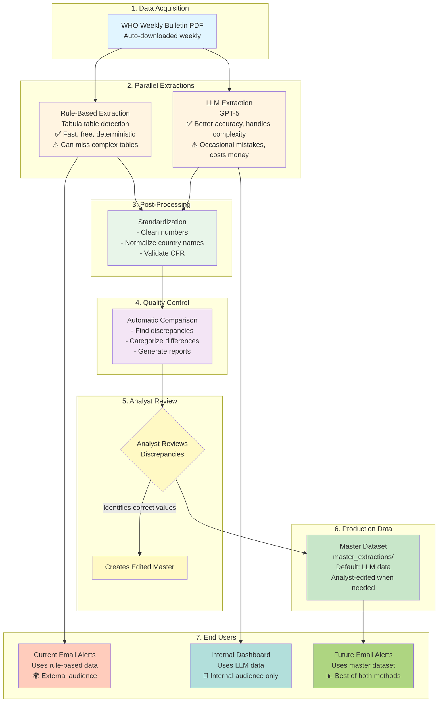
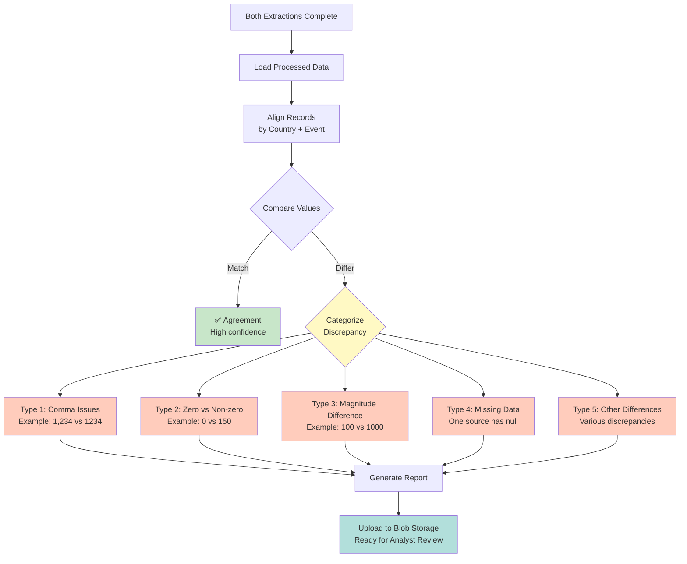
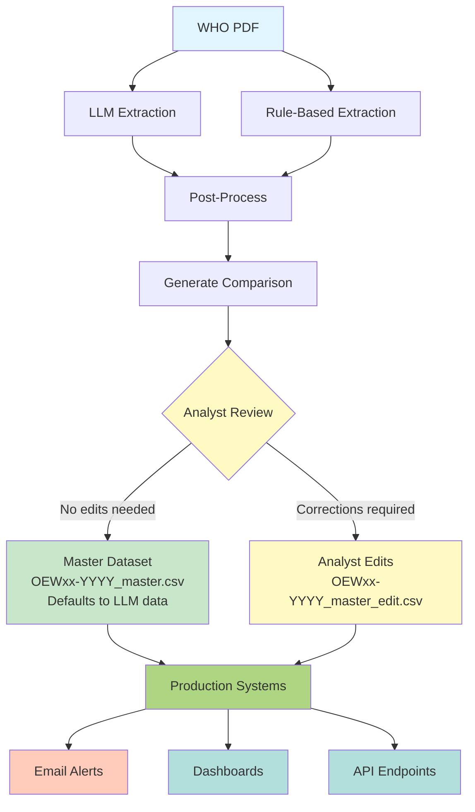
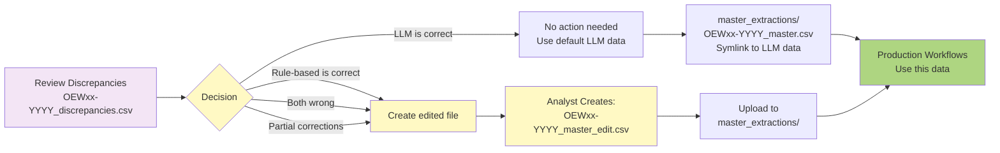

# Cholera Data Pipeline: Architecture for Analysts

## Overview

This document explains the cholera data extraction pipeline architecture and workflows designed for data analysts. It covers how data flows through the system, how to review discrepancies, and how to create the "master" dataset for production use.

---

## Table of Contents

- [Pipeline Architecture](#pipeline-architecture)
- [Data Flow Overview](#data-flow-overview)
- [Extraction Methods](#extraction-methods)
- [Comparison & Quality Control](#comparison--quality-control)
- [Current vs Future Workflows](#current-vs-future-workflows)
- [Creating the Master Dataset](#creating-the-master-dataset)
- [Practical Workflows for Analysts](#practical-workflows-for-analysts)

---

## Pipeline Architecture



---

## Data Flow Overview

### Step-by-Step Process

1. **Weekly PDF Download**
   - Automated GitHub Action downloads latest WHO cholera bulletin
   - Stored in blob storage: `raw/monitoring/pdfs/`

2. **Dual Extraction**
   - **Rule-based**: Uses Tabula library to detect and extract tables
   - **LLM-based**: Sends PDF to GPT model with structured prompts
   - Both produce CSV files in `raw/monitoring/llm_extractions/` and `raw/monitoring/rule_based_extractions/`

3. **Post-Processing**
   - Both extractions standardized using same pipeline
   - Output: `processed/monitoring/llm_extractions/` and `processed/monitoring/rule_based_extractions/`

4. **Automatic Comparison**
   - When both processed files exist for same week/year
   - Generates comparison CSVs: `processed/monitoring/comparisons/`
   - Output files:
     - `OEWxx-YYYY_comparison_summary.csv` - Overview statistics and agreement metrics
     - `OEWxx-YYYY_discrepancies.csv` - Detailed differences with categorization

---

## Blob Storage Structure

The Azure blob storage is organized with a clear separation between raw and processed data:

```
ds-cholera-pdf-scraper/
├── raw/
│   └── monitoring/
│       ├── pdfs/                          # Original WHO bulletins
│       ├── llm_extractions/               # Unprocessed LLM output
│       └── rule_based_extractions/        # Unprocessed rule-based output
│
└── processed/
    ├── monitoring/
    │   ├── llm_extractions/               # Cleaned, standardized LLM data
    │   ├── rule_based_extractions/        # Cleaned, standardized rule-based data
    │   ├── comparisons/                   # Discrepancy analysis (2 CSV files)
    │   └── master_extractions/            # Production-ready master dataset
    │
    └── logs/
        ├── prompt_logs/                   # LLM API call logs
        └── tabular_preprocessing_logs/    # Rule-based extraction logs
```

### Directory Descriptions

| Path | Purpose |
|------|---------|
| `raw/monitoring/pdfs/` | Original WHO PDF bulletins downloaded weekly |
| `raw/monitoring/llm_extractions/` | Unprocessed CSV output from GPT-5 extraction |
| `raw/monitoring/rule_based_extractions/` | Unprocessed CSV output from Tabula extraction |
| `processed/monitoring/llm_extractions/` | Cleaned, standardized LLM data ready for analysis |
| `processed/monitoring/rule_based_extractions/` | Cleaned, standardized rule-based data ready for analysis |
| `processed/monitoring/comparisons/` | Discrepancy analysis between LLM and rule-based (2 CSV files per week) |
| `processed/monitoring/master_extractions/` | Production-ready master dataset (LLM default + analyst edits) |
| `processed/logs/prompt_logs/` | LLM API execution logs and metadata |
| `processed/logs/tabular_preprocessing_logs/` | Rule-based extraction execution logs |

---

## Extraction Methods

### Rule-Based Extraction

**Technology**: Tabula (Java-based table detection)

**Strengths**:
- Fast (no API calls)
- Free (no LLM costs)
- Deterministic (same input = same output)
- Good for well-structured tables

**Weaknesses**:
- Struggles with complex/merged cells
- Can miss tables with unusual formatting
- No contextual understanding

**Use Case**: Currently powers production email alert system

---

### LLM Extraction

**Technology**: OpenAI GPT-5

**Strengths**:
- Handles complex table structures
- Contextual understanding
- Better overall accuracy
- Adapts to format changes

**Weaknesses**:
- Occasional mistakes (hallucination, misinterpretation)
- Costs money per extraction (~$0.50-2 per document)
- Non-deterministic (slight variations between runs)

**Use Case**: Internal analysis and review; recommended for master dataset

---

## Comparison & Quality Control

### Automatic Discrepancy Detection

The system automatically compares LLM vs rule-based extractions and categorizes differences:



### Comparison Output Files

The comparison pipeline generates 2 CSV files for analyst review:

1. **`OEWxx-YYYY_discrepancies.csv`** - Main file showing all differences
   - Columns: `Country`, `Event`, `Field`, `LLM_value`, `RuleBased_value`, `Discrepancy_category`
   - Contains detailed row-by-row comparison of fields where LLM and rule-based differ
   - Each discrepancy is categorized (comma issues, zero vs non-zero, magnitude difference, etc.)

2. **`OEWxx-YYYY_comparison_summary.csv`** - High-level statistics
   - Total records compared
   - Agreement percentage
   - Number of discrepancies by type and field
   - Summary metrics for analyst prioritization

---

## Current vs Future Workflows

### Current Production Workflow


**Status**: Stable, production system for external email alerts

---

### New Internal LLM Workflow


**Status**: For internal use only; under evaluation

---

### Future Master Workflow (Recommended)



**Status**: Planned; combines best of both methods with analyst oversight

---

## Creating the Master Dataset

### Overview

The master dataset (`master_extractions/`) serves as the single source of truth for all production workflows.

### Default Behavior

By default, the master dataset will be populated with **LLM extraction data** because:
1. Generally more accurate overall
2. Better handles complex table structures
3. Fewer systematic errors

### Analyst Edit Workflow

When discrepancies are found, analysts can create corrected versions:



### File Naming Convention

| File Type | Pattern | Source | When to Use |
|-----------|---------|--------|-------------|
| Default Master | `OEWxx-YYYY_master.csv` | Automatic copy of LLM data | No corrections needed |
| Edited Master | `OEWxx-YYYY_master_edit.csv` | Analyst-created | Corrections identified |

### Edit Workflow Steps

1. **Download comparison files** from blob storage:
   ```
   processed/monitoring/comparisons/OEWxx-YYYY_discrepancies.csv
   ```

2. **Review discrepancies** and identify corrections needed

3. **Download source files** (LLM and/or rule-based):
   ```
   processed/monitoring/llm_extractions/OEWxx-YYYY_gpt-5_*.csv
   processed/monitoring/rule_based_extractions/OEWxx-YYYY_rule-based_*.csv
   ```

4. **Create edited master file**:
   - Start with LLM file as base
   - Apply corrections from discrepancy review
   - Save as `OEWxx-YYYY_master_edit.csv`

5. **Upload to master directory**:
   ```
   master_extractions/OEWxx-YYYY_master_edit.csv
   ```

6. **Update production workflows** to prioritize `_edit.csv` files over default `_master.csv`

---

## Practical Workflows for Analysts

### Weekly Review Checklist

**Step 1: Check Extraction Status**
```bash
# View recent workflow runs
gh run list --workflow=llm-extract.yml --limit 5
gh run list --workflow=rule-based-extract.yml --limit 5
```

**Step 2: Verify Comparison Generated**
```bash
# Check if comparison completed
gh run list --workflow=post-process-extractions.yml --limit 3
```

**Step 3: Download Comparison Files**
- Access blob storage: `processed/monitoring/comparisons/`
- Download latest week's discrepancies file

**Step 4: Review Discrepancies**
- Open `OEWxx-YYYY_discrepancies.csv` in Excel/Python
- Focus on high-impact differences:
  - Large magnitude differences (Type 3)
  - Zero vs non-zero (Type 2)
  - Missing data (Type 4)
- Ignore comma-only differences (Type 1) - these are formatting

**Step 5: Investigate Root Cause**
- Download source processed files for both methods
- Check original PDF if needed
- Determine which extraction is correct

**Step 6: Create Master File (if edits needed)**
- Copy LLM file as starting point
- Apply necessary corrections
- Save as `OEWxx-YYYY_master_edit.csv`
- Upload to `master_extractions/` directory

**Step 7: Document Changes**
- Keep a log of manual corrections
- Note patterns (helps improve extraction methods)

---

### Common Discrepancy Patterns

#### Pattern 1: Rule-Based Missing Complex Tables
**Symptoms**: Rule-based has null/empty values; LLM has data

**Example**:
```
Country: DRC
Field: TotalCases
LLM: 1,234
Rule-based: null
```

**Action**: Use LLM value (rule-based likely failed to detect table)

---

#### Pattern 2: LLM Hallucination
**Symptoms**: LLM has plausible but incorrect value; rule-based has different value or null

**Example**:
```
Country: Ethiopia
Field: Deaths
LLM: 45
Rule-based: 54
PDF shows: 54
```

**Action**: Use rule-based value or manually verify against PDF

---

#### Pattern 3: Both Methods Wrong
**Symptoms**: Both extractions differ from PDF source

**Example**:
```
Country: Mozambique
Field: TotalCases
LLM: 10,000
Rule-based: 1,000
PDF shows: 10,500 (includes footnote clarification)
```

**Action**: Create edited master with correct value (10,500)

---

### Tools & Resources

**Blob Storage Access**:
- Development: `ds-cholera-pdf-scraper/processed/monitoring/`
- Comparison reports: `comparisons/`
- LLM extractions: `llm_extractions/`
- Rule-based extractions: `rule_based_extractions/`

**GitHub Actions**:
- Workflow documentation: `.github/WORKFLOWS.md`
- Trigger manual runs: GitHub UI or `gh` CLI

**Python Analysis**:
```python
import pandas as pd

# Load discrepancies
discrep = pd.read_csv('OEW37-2025_discrepancies.csv')

# Filter high-priority issues
critical = discrep[
    (discrep['Discrepancy_category'].isin(['zero_vs_nonzero', 'magnitude_difference']))
    & (discrep['Field'].isin(['TotalCases', 'Deaths']))
]

print(f"Found {len(critical)} critical discrepancies requiring review")
```

---

## Key Decisions for Analysts

### When to Use Rule-Based Data
- Simple, well-structured tables
- When LLM shows clear errors (verified against PDF)
- Cost constraints (no API charges)

### When to Use LLM Data
- Complex or merged cell tables
- When rule-based extraction fails/incomplete
- When accuracy is critical (default recommendation)

### When to Create Edited Master
- Discrepancies with significant impact (deaths, case counts)
- Both methods wrong (verified against PDF)
- Systematic errors detected
- High-visibility reports

---

## Future Enhancements

### Planned Improvements

1. **Master Dataset Automation**
   - Automatic population of `master_extractions/`
   - Default to LLM with confidence scoring
   - Auto-flag low-confidence extractions for review

2. **Enhanced Comparison Reports**
   - Confidence scoring for each field
   - Historical discrepancy trends
   - Automated suggestions (e.g., "Rule-based historically accurate for this country")

3. **Analyst UI/Dashboard**
   - Web interface for reviewing discrepancies
   - Side-by-side PDF viewer with extractions
   - One-click master file creation

4. **Email Alert Transition**
   - Migrate from rule-based to master dataset
   - A/B testing period with both methods
   - Rollout to external audience after validation period

---

## Support & Contact

For questions about:
- **Pipeline architecture**: See `.github/WORKFLOWS.md`
- **Extraction methods**: See `docs/rule-based-extraction.md`
- **Development setup**: See `docs/development_setup.md`

---

**Document Version**: 1.0
**Last Updated**: December 2024
**Maintained By**: Data Science Team
